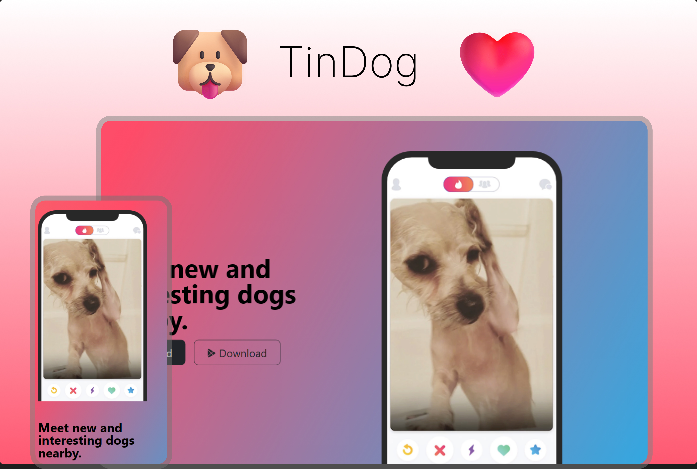

<h1 align="center"> TinDog </h1>

Página web criada para demonstrar o projeto TinDog, um aplicativo de relacionamento entre cães. 

  <a href="#-tecnologias">Tecnologias</a>&nbsp;&nbsp;&nbsp;|&nbsp;&nbsp;&nbsp;
  <a href="#-projeto">Projeto</a>

 

  

## 🌐 Tecnologias

Esse projeto foi desenvolvido utilizando as seguintes tecnologias:

- HTML
- CSS
- Bootstrap
- Git
- Github
- Figma

## 🔗 Projeto

A TinDog é um aplicativo de relacionamento para cães.

- [Acesse o projeto finalizado, online](https://lgm-mendes.github.io/tindog)

---

 

  Feito com ♥ por Lucas Mendes 

